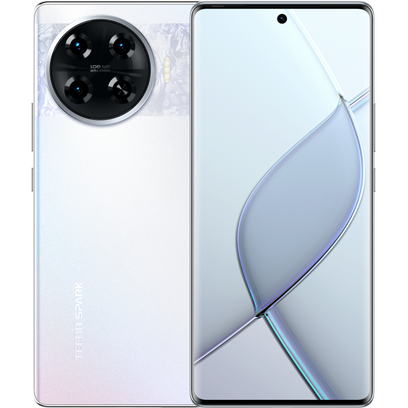
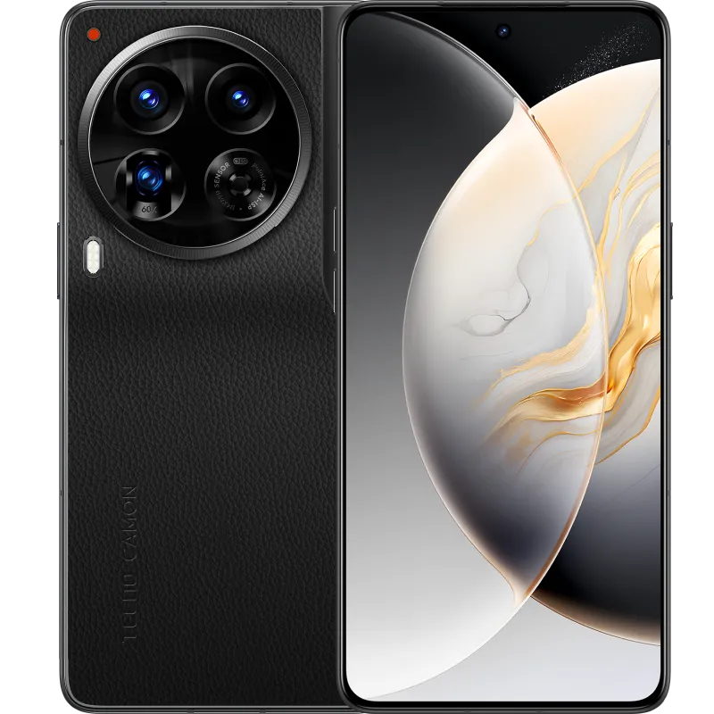

<html>
<head>
    <meta charset="UTF-8">
    <meta name="viewport" content="width=device-width, initial-scale=1.0">
    <title>Document</title>
    
    
 </head>
 <body>
   

        

            
            <h1 style="color: blue;">TecnoZone</h1>
        

    

    

        <a href="#" style="font-family: Cambria, Cochin, Georgia, Times, 'Times New Roman', serif; font-size: large; background-color: #888;">HOME</a>
        <a href="lab7.html" style="font-family: Cambria, Cochin, Georgia, Times, 'Times New Roman', serif; font-size: large;">PRODUCTS</a>
        <a href="about.html" style="font-family: Cambria, Cochin, Georgia, Times, 'Times New Roman', serif; font-size: large;">ABOUT</a>
        

            <select class="dropdown" onchange="window.location.href=this.value;">
                <option class="series-title" style="font-family: Cambria, Cochin, Georgia, Times, 'Times New Roman', serif;" selected>SERIES</option>
                <option value="spark.html">Tecno Spark</option>
                <option value="camon.html">Tecno Camon</option>
                <option value="pova.html">Tecno Pova</option>
            </select>
        

    

    
    

    <!-- Open Login Label -->
    <a class="open-login" >
        <button onclick="showLogin()">Login</button>
    </a>
    
    

    

        
&times;

        <h2>Login</h2>
        <form>
            <label for="username">Username</label>
            <input type="text" id="username" placeholder="Enter your username" required>

            <label for="password">Password</label>
            <input type="password" id="password" placeholder="Enter your password" required>

            <button type="submit">Login</button>
            
Don't have an account? Register here!

        </form>
    

    

    <!-- Login Form -->
    

        
&times;

        <h2>Login</h2>
        <form>
            <label for="username">Username</label>
            <input type="text" id="username" placeholder="Enter your username" required>
    
            <label for="password">Password</label>
            <input type="password" id="password" placeholder="Enter your password" required>
    
            <button type="submit">Login</button>
            
Don't have an account? Register here!

        </form>
    

    
    <!-- Register Form -->
    

        
&times;

        <h2>Register</h2>
        <form>
            <label for="email">Email Address</label>
            <input type="email" id="email" placeholder="Enter your email" required>
    
            <label for="firstName">First Name</label>
            <input type="text" id="firstName" placeholder="Enter your first name" required>
    
            <label for="lastName">Last Name</label>
            <input type="text" id="lastName" placeholder="Enter your last name" required>
    
            <label for="birthdate">Birthdate</label>
            <input type="date" id="birthdate" required>
    
            <label for="regUsername">Username</label>
            <input type="text" id="regUsername" placeholder="Choose a username" required>
    
            <label for="regPassword">Password</label>
            <input type="password" id="regPassword" placeholder="Create a password" required>
    
            <button type="submit">Save</button>
            
Already have an account? Log-in here!

        </form>
    

    

    

    

        

            
            
            
            
            
            
            
            
            
            

            

        

        
    
    

    
LOOKING FOR AFFORDABLE PHONE OPTIONS?
         HERE ARE SOME TOP PICKS!
    

        

            <a href="22.html">
                

                
                
 Tecno Pova 6 pro 5G

            
</a>
            <a href="1.html">
              

                
              
Tecno Pova 3

            
            
</a>
            
        
                

                  
                  
Tecno Pova 5 X Free Fire

            
            
</a>
            <a href="11.html">
              

              
              
Tecno Pova neo 3

            
            
</a>
            <a href="29.html">
              

              
              
 Tecno Pova 4 pro

            
</a>

    

 </body>
 </html>
